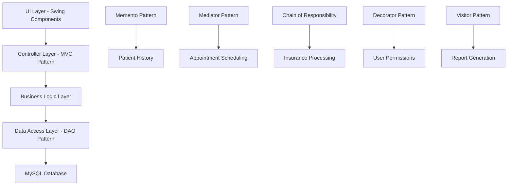

# 🏥 GlobeMed Healthcare Management System

<div align="center">


**A comprehensive healthcare management system built with Java, featuring patient management, appointment scheduling, billing, and advanced reporting capabilities.**

[🚀 Getting Started](#-getting-started) • [📋 Features](#-features) • [🏗️ Architecture](#️-architecture) • [📖 Documentation](#-documentation)

</div>

---

## 📋 Features

### 🏥 **Core Healthcare Management**
- **Patient Records Management** with history tracking (Memento Pattern)
- **Appointment Scheduling** with conflict resolution (Mediator Pattern)  
- **Medical Staff Management** with role-based permissions (Decorator Pattern)
- **Insurance Claims Processing** with automated workflows (Chain of Responsibility)

### 💰 **Financial Management**
- **Medical Billing System** with insurance integration
- **Payment Processing** and tracking
- **Financial Reporting** with comprehensive analytics
- **Aged Receivables Analysis** for outstanding payments

### 📊 **Advanced Reporting**
- **Patient Financial Summaries** with detailed breakdowns
- **Service Revenue Analysis** by department/service type
- **Comprehensive Financial Reports** with trend analysis
- **PDF Generation** for bills and reports (iText integration)

### 🔐 **Security & Access Control**
- **Role-Based Authentication** (Admin, Doctor, Nurse)
- **Permission-Based Feature Access** 
- **Secure User Management** with encrypted credentials
- **Audit Trail** for sensitive operations

### 🎨 **User Experience**
- **Intuitive Swing GUI** with modern design principles
- **Dark/Light Theme Support** for user preference
- **Responsive Layout** adapting to different screen sizes
- **Keyboard Shortcuts** for efficient workflow

---

## 🛠️ Technology Stack

| Component | Technology | Purpose |
|-----------|------------|---------|
| **Backend** | Java 17+ | Core application logic |
| **Frontend** | Java Swing | Desktop GUI interface |
| **Database** | MySQL 8.0+ | Data persistence |
| **Build Tool** | Maven 3.9+ | Dependency management |
| **PDF Generation** | iText 5.5.13 | Report and bill generation |
| **PDF Processing** | Apache PDFBox 2.0.29 | Additional PDF utilities |

---

## 🏗️ Architecture

### Design Patterns Implementation



### Core Components

#### 🎯 **Authentication System**
```java
// Role-based access with Decorator Pattern
IUser user = new BaseUser(username, role, doctorId);
user = new AdminRole(user);  // Adds admin permissions
user = new DoctorRole(user); // Adds doctor permissions
```

#### 📋 **Patient Management**
```java
// History tracking with Memento Pattern
RecordHistory history = new RecordHistory(patientRecord);
history.save();           // Create snapshot
patientRecord.update();   // Make changes
history.undo();          // Restore previous state
```

#### 📅 **Appointment Scheduling**
```java
// Conflict resolution with Mediator Pattern
SchedulingMediator mediator = new SchedulingMediator();
mediator.scheduleAppointment(patient, doctor, dateTime);
```

---

## 🚀 Getting Started

### Prerequisites

Ensure you have the following installed:
- ☕ **Java Development Kit (JDK) 17+**
- 🗄️ **MySQL Server 8.0+**
- 🔧 **Apache Maven 3.9+**
- 🖥️ **IDE** (IntelliJ IDEA, Eclipse, or VS Code recommended)

### Installation

1. **Clone the Repository**
   ```bash
   git clone https://github.com/isharax9/healthcare-system.git
   cd healthcare-system
   ```

2. **Database Setup**
   ```bash
   # Create database and import schema
   mysql -u root -p
   CREATE DATABASE globemed_db;
   USE globemed_db;
   SOURCE globemed_db.sql;
   ```

3. **Configure Database Connection**
   
   Create `src/main/java/com/globemed/db/DatabaseManager.java`:
   ```java
   public class DatabaseManager {
       private static final String URL = "jdbc:mysql://localhost:3306/globemed_db";
       private static final String USERNAME = "your_username";
       private static final String PASSWORD = "your_password";
       
       public static Connection getConnection() throws SQLException {
           return DriverManager.getConnection(URL, USERNAME, PASSWORD);
       }
   }
   ```

4. **Build and Run**
   ```bash
   # Compile the project
   mvn clean compile
   
   # Run the application
   mvn exec:java -Dexec.mainClass="com.globemed.Main"
   ```

### 🔑 Default Login Credentials

| Role | Username | Password | Access Level |
|------|----------|----------|--------------|
| Admin | `admin` | `admin123` | Full system access |
| Doctor | `doctor1` | `doc123` | Patient & appointment management |
| Nurse | `nurse1` | `nurse123` | Limited patient access |

---

## 📖 Usage Guide

### 🏥 **Patient Management**
1. Navigate to **Patient Records** tab
2. **Add New Patient**: Fill in demographic and insurance information
3. **Update Records**: Modify existing patient information with automatic history tracking
4. **Search Patients**: Use filters to quickly locate patient records

### 📅 **Appointment Scheduling**
1. Go to **Appointments** tab
2. **Schedule New**: Select patient, doctor, and available time slot
3. **Manage Existing**: View, reschedule, or cancel appointments
4. **Conflict Resolution**: System automatically detects and prevents double-booking

### 💳 **Billing Operations**
1. Access **Billing** module
2. **Create Bills**: Generate charges for services rendered
3. **Process Insurance**: Automatic calculation of coverage and patient responsibility
4. **Payment Tracking**: Record payments and manage outstanding balances

### 📊 **Report Generation**
1. Navigate to **Reports** section
2. **Select Report Type**: Choose from financial, patient, or operational reports
3. **Set Parameters**: Define date ranges and filters
4. **Generate & Export**: Create PDF reports for analysis or printing

---

## 🗃️ Database Schema

### Core Tables

```sql
-- Patient Management
patients (patient_id, name, dob, gender, address, phone, email, insurance_plan_id)
insurance_plans (plan_id, plan_name, coverage_percent, deductible)

-- Appointment System  
appointments (appointment_id, patient_id, doctor_id, appointment_datetime, status)
doctors (doctor_id, name, specialization, phone, email)

-- Billing & Finance
billing (bill_id, patient_id, service_description, amount, status)
payments (payment_id, bill_id, amount_paid, payment_date, payment_method)

-- Staff Management
staff (staff_id, name, role, department, hire_date, salary)
users (user_id, username, password_hash, role, staff_id)
```

### Relationships
- **One-to-Many**: Patient → Appointments, Patient → Bills
- **Many-to-One**: Appointments → Doctor, Bills → Insurance Plan
- **One-to-One**: User → Staff (for authentication)

---

## 🔧 Configuration

### Application Properties
Create `application.properties` in `src/main/resources/`:

```properties
# Database Configuration
db.url=jdbc:mysql://localhost:3306/globemed_db
db.username=root
db.password=your_password
db.driver=com.mysql.cj.jdbc.Driver

# Application Settings
app.name=GlobeMed Healthcare System
app.version=1.4
app.theme=light

# Report Settings
reports.output.path=./reports/
reports.logo.path=./assets/logo.png
```

### Theme Customization
The system supports custom themes through the UI. Users can toggle between:
- 🌞 **Light Theme**: Default professional appearance
- 🌙 **Dark Theme**: Reduced eye strain for extended use

---

## 🧪 Testing

### Unit Tests
```bash
# Run all tests
mvn test

# Run specific test class
mvn test -Dtest=PatientDAOTest

# Generate test coverage report
mvn jacoco:report
```

### Integration Tests
```bash
# Database integration tests
mvn verify -Pintegration-tests

# UI component tests
mvn test -Dtest=*UITest
```

---

## 📚 API Documentation

### Core Service Classes

#### Patient Service
```java
public class PatientService {
    public PatientRecord createPatient(PatientData data);
    public List<PatientRecord> searchPatients(SearchCriteria criteria);
    public PatientRecord updatePatient(String patientId, PatientData data);
    public void deletePatient(String patientId);
}
```

#### Appointment Service
```java
public class AppointmentService {
    public Appointment scheduleAppointment(AppointmentRequest request);
    public List<Appointment> getAppointmentsByDate(LocalDate date);
    public void cancelAppointment(int appointmentId);
    public List<TimeSlot> getAvailableSlots(String doctorId, LocalDate date);
}
```

#### Billing Service
```java
public class BillingService {
    public MedicalBill createBill(BillRequest request);
    public PaymentResult processPayment(PaymentRequest request);
    public List<MedicalBill> getOutstandingBills(String patientId);
    public void generatePDFBill(MedicalBill bill, OutputStream output);
}
```

---

## 🤝 Contributing

We welcome contributions! Please follow these guidelines:

### Development Workflow
1. **Fork** the repository
2. **Create** a feature branch (`git checkout -b feature/amazing-feature`)
3. **Commit** changes (`git commit -m 'Add amazing feature'`)
4. **Push** to branch (`git push origin feature/amazing-feature`)
5. **Open** a Pull Request

### Code Standards
- Follow **Java coding conventions**
- Add **JavaDoc** comments for public methods
- Write **unit tests** for new features
- Ensure **Maven build** passes
- Update **documentation** for new features

### Bug Reports
Please include:
- 🐛 **Clear description** of the issue
- 📝 **Steps to reproduce** the problem
- 🖥️ **Environment details** (OS, Java version, MySQL version)
- 📸 **Screenshots** if applicable

---

## 📜 License

This project is licensed under the **MIT License** - see the [LICENSE](LICENSE) file for details.

---

## 👨‍💻 Authors & Acknowledgments

- **Development Team**: GlobeMed Healthcare Solutions
- **Lead Developer**: [@isharax9](https://github.com/isharax9)
- **Architecture**: Design Patterns implementation for enterprise healthcare

### Special Thanks
- Java Community for excellent documentation
- iText team for PDF generation capabilities
- MySQL for robust database support
- Apache Maven for build automation

---

## 📞 Support & Contact

- 📧 **Email**: support@globemed.com
- 🐛 **Bug Reports**: [GitHub Issues](https://github.com/isharax9/healthcare-system/issues)
- 💬 **Discussions**: [GitHub Discussions](https://github.com/isharax9/healthcare-system/discussions)
- 📖 **Documentation**: [Wiki](https://github.com/isharax9/healthcare-system/wiki)

---

<div align="center">

**⭐ Star this repository if it helped you!**

[](https://github.com/isharax9/healthcare-system/stargazers)
[](https://github.com/isharax9/healthcare-system/network/members)

</div>