# 🏥 GlobeMed Healthcare Management System

<div align="center">


**🚀 A comprehensive, enterprise-grade healthcare management system built with Java 21, featuring advanced patient management, intelligent appointment scheduling, automated billing, and powerful reporting capabilities with modern UI/UX design.**

📚 **[📖 Complete Project Documentation](https://macnalk.github.io/GlobeMed-HMS-Docs/)** - Detailed documentation, guides, and specifications

[🚀 Quick Start](#-getting-started) • [📊 UML Diagrams](#-uml-class-diagrams) • [📋 Features](#-features) • [🏗️ Architecture](#️-architecture) • [📖 API Docs](#-api-documentation)

[](https://github.com/isharax9/healthcare-system/stargazers)
[](https://github.com/isharax9/healthcare-system/network/members)

---

## 📚 Table of Contents

<div align="center">

| Section | Description |
|---------|-------------|
| [📊 UML Class Diagrams](#-uml-class-diagrams) | System architecture and design patterns visualization |
| [📋 Features](#-features) | Comprehensive feature overview and capabilities |
| [🛠️ Technology Stack](#️-technology-stack) | Technologies, frameworks, and tools used |
| [🏗️ Architecture](#️-architecture) | System design and architectural patterns |
| [🚀 Getting Started](#-getting-started) | Installation guide and setup instructions |
| [📖 Usage Guide](#-usage-guide) | Step-by-step usage instructions |
| [🗃️ Database Schema](#️-database-schema) | Database structure and relationships |
| [🔧 Configuration](#-configuration) | Application configuration and customization |
| [🧪 Testing](#-testing) | Testing guidelines and procedures |
| [📚 API Documentation](#-api-documentation) | API reference and code examples |
| [🤝 Contributing](#-contributing) | How to contribute to the project |
| [📜 License & Legal](#-license--legal) | Licensing information and compliance |
| [👨‍💻 Authors & Acknowledgments](#-authors--acknowledgments) | Credits and acknowledgments |
| [📞 Support & Community](#-support--community) | Getting help and community resources |

</div>

</div>

---

## 📊 UML Class Diagrams

<div align="center">

### 🔗 Quick Navigation
[🏗️ Complete Overview](#complete-application-overview) • [📊 Entity Relationships](#entity-relationship-diagram) • [👤 Patient Management](#part-a---patient-record-management-memento-prototype) • [📅 Appointments](#part-b---appointment-scheduling-mediator) • [💰 Billing](#part-c---billing-and-insurance-claims-chain-of-responsibility) • [👨‍⚕️ Staff Roles](#part-d---medical-staff-roles-and-permissions-decorator) • [📋 Reports](#part-e---generating-medical-reports-visitor) • [🔐 Security](#part-f---security-considerations-decorator-dao)

</div>

> 💡 **Tip**: Right-click any image and select "Open image in new tab" to view at maximum quality

### Complete Application Overview
<div align="center">

</div>

*Complete system architecture showing all components, design patterns, and their relationships*

### Entity Relationship Diagram  
<div align="center">

</div>

*Database schema and table relationships for the healthcare management system*

### Part A - Patient Record Management (Memento, Prototype)
<div align="center">

</div>

*Implementation of Memento pattern for patient history tracking and Prototype pattern for record templates*

### Part B - Appointment Scheduling (Mediator)
<div align="center">

</div>

*Mediator pattern implementation for handling appointment conflicts and scheduling logic*

### Part C - Billing and Insurance Claims (Chain of Responsibility)
<div align="center">

</div>

*Chain of Responsibility pattern for processing insurance claims and payment workflows*

### Part D - Medical Staff Roles and Permissions (Decorator)
<div align="center">

</div>

*Decorator pattern implementation for flexible role-based access control system*

### Part E - Generating Medical Reports (Visitor)
<div align="center">

</div>

*Visitor pattern for extensible report generation and data analysis capabilities*

### Part F - Security Considerations (Decorator, DAO)
<div align="center">

</div>

*Security architecture using Decorator pattern for permissions and DAO pattern for secure data access*

---


## 📋 Features

<div align="center">

### 🌟 **Core Healthcare Management Suite**

</div>

<table>
<tr>
<td width="50%">

#### 🏥 **Patient & Records Management**
- 📋 **Comprehensive Patient Profiles** with demographic data
- 🔄 **History Tracking** using Memento Pattern for audit trails  
- 🔍 **Advanced Search & Filtering** with multiple criteria
- 📊 **Insurance Plan Integration** with automatic calculations
- 🔒 **HIPAA-Compliant** data handling and encryption

#### 💰 **Financial & Billing System**
- 💳 **Medical Billing Engine** with itemized service tracking
- 🏛️ **Insurance Claims Processing** with automated workflows
- 💸 **Payment Management** supporting multiple methods
- 📈 **Financial Analytics** with trend analysis
- 🧾 **Professional PDF Bills** with company branding

</td>
<td width="50%">

#### 📅 **Appointment & Scheduling**
- 🗓️ **Intelligent Scheduling** with conflict detection
- ⚡ **Real-time Availability** checking across all staff
- 🔔 **Automated Notifications** for upcoming appointments
- 📱 **Multi-doctor Coordination** using Mediator Pattern
- ⏰ **Flexible Time Slots** with customizable durations

#### 🔐 **Security & Access Control**
- 👤 **Role-Based Authentication** (Admin/Doctor/Nurse)
- 🛡️ **Permission-Based Features** using Decorator Pattern
- 🔐 **Encrypted User Credentials** with secure storage
- 📋 **Comprehensive Audit Trails** for compliance
- 🚨 **Data Protection** following healthcare regulations

</td>
</tr>
</table>

### 📊 **Advanced Reporting & Analytics**

<div align="center">

| Report Type | Features | Output Format | Key Benefits |
|-------------|----------|---------------|--------------|
| 💰 **Financial Reports** | Revenue analysis, payment tracking, aged receivables | PDF, Excel | Business intelligence & decision making |
| 👥 **Patient Analytics** | Demographics, visit patterns, treatment outcomes | PDF, Charts | Improved patient care & resource planning |
| 📈 **Operational Reports** | Staff productivity, appointment efficiency, resource utilization | Dashboard, PDF | Operational optimization & cost reduction |
| 🏥 **Service Analysis** | Department performance, service revenue, trend analysis | Visual Charts | Strategic planning & service improvement |

</div>

### 🎨 **User Experience & Interface**

<div align="center">

**🖥️ Modern Desktop Application** • **🌓 Dark/Light Themes** • **⌨️ Keyboard Shortcuts** • **📱 Responsive Design** • **🎯 Intuitive Navigation**

</div>

> 🚀 **Built with Enterprise Patterns**: Memento, Mediator, Chain of Responsibility, Decorator, Visitor, and DAO patterns for maintainable, scalable architecture

---

## 🛠️ Technology Stack

<div align="center">

| Component | Technology | Version | Purpose |
|-----------|------------|---------|---------|
| **Backend Language** | ☕ Java | 17+ | Core application logic & enterprise features |
| **Frontend Framework** | 🖥️ Java Swing | Built-in | Desktop GUI interface with modern theming |
| **Database Engine** | 🗄️ MySQL | 8.0+ | Robust data persistence & ACID compliance |
| **Build Automation** | 🔧 Apache Maven | 3.9+ | Dependency management & project lifecycle |
| **PDF Generation** | 📄 iText | 5.5.13.3 | Professional bill & report generation |
| **PDF Processing** | 📋 Apache PDFBox | 2.0.29 | Advanced PDF manipulation utilities |
| **Design Patterns** | 🏗️ Gang of Four | Multiple | Enterprise architecture patterns |

</div>

---

## 🏗️ Architecture

<div align="center">

### 🎯 **Design Pattern Implementation Strategy**

</div>

<table>
<tr>
<td width="50%">

#### 🔄 **Behavioral Patterns**
- **🎭 Memento Pattern** - Patient history tracking & undo operations
- **🤝 Mediator Pattern** - Appointment scheduling coordination  
- **⛓️ Chain of Responsibility** - Insurance claim processing pipeline
- **👁️ Visitor Pattern** - Extensible report generation system

</td>
<td width="50%">

#### 🏗️ **Structural & Creational Patterns**
- **🎨 Decorator Pattern** - Role-based permission system
- **🏭 DAO Pattern** - Data access abstraction layer
- **📋 Prototype Pattern** - Patient record templates
- **🔧 MVC Pattern** - Clean separation of concerns

</td>
</tr>
</table>

### 🌐 **System Architecture Overview**

```mermaid
graph TB
    A[🖥️ UI Layer - Swing Components] --> B[🎮 Controller Layer - MVC Pattern]
    B --> C[💼 Business Logic Layer]
    C --> D[🗄️ Data Access Layer - DAO Pattern]
    D --> E[🐬 MySQL Database]
    
    F[📝 Memento Pattern] --> G[👤 Patient History]
    H[🤝 Mediator Pattern] --> I[📅 Appointment Scheduling]
    J[⛓️ Chain of Responsibility] --> K[💰 Insurance Processing]
    L[🎨 Decorator Pattern] --> M[🔐 User Permissions]
    N[👁️ Visitor Pattern] --> O[📊 Report Generation]
    
    style A fill:#e1f5fe
    style B fill:#f3e5f5
    style C fill:#e8f5e8
    style D fill:#fff3e0
    style E fill:#ffebee
```



### 💻 **Core Implementation Examples**

#### 🎯 **Authentication System**
```java
// Role-based access with Decorator Pattern
IUser user = new BaseUser(username, role, doctorId);
user = new AdminRole(user);  // Adds admin permissions
user = new DoctorRole(user); // Adds doctor permissions

// Check permissions
if (user.hasPermission("PATIENT_MANAGEMENT")) {
    // Access granted
}
```

#### 📋 **Patient Management**
```java
// History tracking with Memento Pattern
RecordHistory history = new RecordHistory(patientRecord);
history.save();           // Create snapshot
patientRecord.update();   // Make changes
history.undo();          // Restore previous state

// Prototype pattern for templates
PatientRecord template = TemplateManager.getTemplate("BASIC_PATIENT");
PatientRecord newPatient = template.clone();
```

#### 📅 **Appointment Scheduling**
```java
// Conflict resolution with Mediator Pattern
SchedulingMediator mediator = new SchedulingMediator();
AppointmentResult result = mediator.scheduleAppointment(
    patient, doctor, dateTime, duration
);

if (result.hasConflict()) {
    List<TimeSlot> alternatives = result.getAlternatives();
}
```

#### 💰 **Insurance Processing**
```java
// Chain of Responsibility for claims
ClaimProcessor basicProcessor = new BasicClaimProcessor();
ClaimProcessor premiumProcessor = new PremiumClaimProcessor();
ClaimProcessor vipProcessor = new VIPClaimProcessor();

basicProcessor.setNext(premiumProcessor).setNext(vipProcessor);
ClaimResult result = basicProcessor.process(claim);
```

---

## 🚀 Getting Started

### Prerequisites

<div align="center">

| Requirement | Version | Download Link | Purpose |
|-------------|---------|---------------|---------|
| ☕ **Java Development Kit (JDK)** | 17+ | [Oracle JDK](https://www.oracle.com/java/technologies/downloads/) \| [OpenJDK](https://openjdk.org/) | Core runtime & development |
| 🗄️ **MySQL Server** | 8.0+ | [MySQL Downloads](https://dev.mysql.com/downloads/mysql/) | Database engine |
| 🔧 **Apache Maven** | 3.9+ | [Maven Downloads](https://maven.apache.org/download.cgi) | Build automation |
| 🖥️ **IDE (Recommended)** | Latest | [IntelliJ IDEA](https://www.jetbrains.com/idea/) \| [Eclipse](https://www.eclipse.org/) \| [VS Code](https://code.visualstudio.com/) | Development environment |

</div>

> 💡 **Note**: This project uses Java 17+ features for optimal performance and compatibility across different environments..

### Installation

<div align="center">

#### 🚀 **Quick Setup Guide**

</div>

1. **📥 Clone the Repository**
   ```bash
   git clone https://github.com/isharax9/healthcare-system.git
   cd healthcare-system
   ```

2. **🗄️ Database Setup**
   ```bash
   # Start MySQL and create database
   mysql -u root -p
   ```
   ```sql
   CREATE DATABASE globemed_db CHARACTER SET utf8mb4 COLLATE utf8mb4_unicode_ci;
   USE globemed_db;
   SOURCE globemed_db.sql;
   ```

3. **⚙️ Configure Database Connection**
   
   Update `src/main/java/com/globemed/db/DatabaseManager.java`:
   ```java
   private static final String JDBC_URL = "jdbc:mysql://localhost:3306/globemed_db";
   private static final String USERNAME = "your_username";  // Update this
   private static final String PASSWORD = "your_password";  // Update this
   ```

4. **🔧 Build and Run**
   ```bash
   # Clean and compile the project
   mvn clean compile
   
   # Run the application
   mvn exec:java -Dexec.mainClass="com.globemed.Main"
   
   # Create executable JAR
   mvn clean package
   
   # Run the executable JAR
   java -jar target/healthcare-system-1.0-SNAPSHOT-executable.jar
   ```

## 📦 Cross-Platform Builds

The project includes automated CI/CD pipelines that generate native executables for all major platforms:

### **Available Distributions**

| Platform | File Types | Installation Method |
|----------|------------|-------------------|
| 🖥️ **Windows** | `.exe` installer | Double-click to install, includes Start Menu shortcuts |
| 🍎 **macOS** | `.dmg`, `.app` bundle | Drag to Applications folder or run DMG installer |
| 🐧 **Linux** | `.deb`, `.rpm`, portable scripts | Package manager installation or direct execution |
| ☕ **Universal** | `.jar` executable | Run with `java -jar` (requires Java 17+) |

### **Manual Releases** 

> **Important**: Automated releases are temporarily disabled. Use manual tag-based releases.

- **Manual Process**: Create version tags to trigger releases (`git tag v1.0.1 && git push origin v1.0.1`)
- **Cross-Platform Builds**: Automatic builds for Windows, macOS, and Linux on tag push
- **Release Packaging**: Tagged releases automatically create distributable packages
- **GitHub Actions**: Fully automated build pipeline with artifact uploads
- **Complete Control**: Manual control over release timing and versioning

> 📋 **Release Guide**: Follow the [Manual Release Guide](MANUAL_RELEASE_GUIDE.md) for step-by-step instructions on creating releases.
> 🔐 **CI/CD Configuration**: For automated builds with database integration, see the [GitHub Secrets Setup Guide](GITHUB_SECRETS_SETUP.md) to configure repository secrets properly.

### **Manual Build Commands**

```bash
# Build for all platforms (requires platform-specific runners)
mvn clean package -DskipTests

# Create Windows installer (requires Windows with jpackage)
jpackage --input target --name "GlobeMed Healthcare System" --main-jar healthcare-system-1.0-SNAPSHOT-executable.jar --main-class com.globemed.Main --type exe

# Create macOS app (requires macOS with jpackage)  
jpackage --input target --name "GlobeMed Healthcare System" --main-jar healthcare-system-1.0-SNAPSHOT-executable.jar --main-class com.globemed.Main --type dmg

# Create Linux packages (requires Linux with jpackage)
jpackage --input target --name "globemed-healthcare-system" --main-jar healthcare-system-1.0-SNAPSHOT-executable.jar --main-class com.globemed.Main --type deb
```

<div align="center">

#### 🎉 **First Launch**

Upon successful launch, you'll see the modern Swing GUI with login screen.

> 💡 **Pro Tip**: Use the default credentials below to explore all features immediately!

</div>

### 🔑 Default Login Credentials

<div align="center">

| 👤 Role | 🔐 Username | 🗝️ Password | 🎯 Access Level | 📋 Capabilities |
|---------|-------------|-------------|-----------------|------------------|
| 👑 **Admin** | `admin` | `admin123` | 🔓 Full system access | User management, system configuration, all reports |
| 👨‍⚕️ **Doctor** | `doctor1` | `doc123` | 📋 Clinical access | Patient records, appointments, medical reports |
| 👩‍⚕️ **Nurse** | `nurse1` | `nurse123` | 📝 Limited access | Basic patient info, appointment viewing |

</div>

> ⚠️ **Security Note**: Change these default credentials immediately in production environments!

---

## 📖 Usage Guide

### 🏥 **Patient Management**
1. Navigate to **Patient Records** tab
2. **Add New Patient**: Fill in demographic and insurance information
3. **Update Records**: Modify existing patient information with automatic history tracking
4. **Search Patients**: Use filters to quickly locate patient records

### 📅 **Appointment Scheduling**
1. Go to **Appointments** tab
2. **Schedule New**: Select patient, doctor, and available time slot
3. **Manage Existing**: View, reschedule, or cancel appointments
4. **Conflict Resolution**: System automatically detects and prevents double-booking

### 💳 **Billing Operations**
1. Access **Billing** module
2. **Create Bills**: Generate charges for services rendered
3. **Process Insurance**: Automatic calculation of coverage and patient responsibility
4. **Payment Tracking**: Record payments and manage outstanding balances

### 📊 **Report Generation**
1. Navigate to **Reports** section
2. **Select Report Type**: Choose from financial, patient, or operational reports
3. **Set Parameters**: Define date ranges and filters
4. **Generate & Export**: Create PDF reports for analysis or printing

---

## 🗃️ Database Schema

### Core Tables

```sql
-- Patient Management
patients (patient_id, name, dob, gender, address, phone, email, insurance_plan_id)
insurance_plans (plan_id, plan_name, coverage_percent, deductible)

-- Appointment System  
appointments (appointment_id, patient_id, doctor_id, appointment_datetime, status)
doctors (doctor_id, name, specialization, phone, email)

-- Billing & Finance
billing (bill_id, patient_id, service_description, amount, status)
payments (payment_id, bill_id, amount_paid, payment_date, payment_method)

-- Staff Management
staff (staff_id, name, role, department, hire_date, salary)
users (user_id, username, password_hash, role, staff_id)
```

### Relationships
- **One-to-Many**: Patient → Appointments, Patient → Bills
- **Many-to-One**: Appointments → Doctor, Bills → Insurance Plan
- **One-to-One**: User → Staff (for authentication)

---

## 🔧 Configuration

### Database Configuration

The application supports flexible database configuration through environment variables, system properties, or configuration files.

> 📚 **Multiple Configuration Guides Available:**
> - [Environment Setup Guide](ENVIRONMENT_SETUP.md) - Local development setup
> - [GitHub Secrets Setup Guide](GITHUB_SECRETS_SETUP.md) - CI/CD and repository configuration
> - [Contributing Guide](CONTRIBUTING.md) - Development workflow

#### **Method 1: Environment Variables (Recommended for Production)**

Set the following environment variables:

```bash
# Linux/macOS
export DB_URL="jdbc:mysql://localhost:3306/globemed_db"
export DB_USERNAME="your_username" 
export DB_PASSWORD="your_password"

# Windows Command Prompt
set DB_URL=jdbc:mysql://localhost:3306/globemed_db
set DB_USERNAME=your_username
set DB_PASSWORD=your_password

# Windows PowerShell
$env:DB_URL="jdbc:mysql://localhost:3306/globemed_db"
$env:DB_USERNAME="your_username"
$env:DB_PASSWORD="your_password"
```

#### **Method 2: System Properties**

When running the application:

```bash
java -jar healthcare-system-1.0-SNAPSHOT-executable.jar \
     -Ddb.url="jdbc:mysql://localhost:3306/globemed_db" \
     -Ddb.username="your_username" \
     -Ddb.password="your_password"

# Or with Maven
mvn exec:java -Ddb.url="jdbc:mysql://localhost:3306/globemed_db" \
              -Ddb.username="your_username" \
              -Ddb.password="your_password"
```

#### **Method 3: Application Properties File**

Edit `src/main/resources/application.properties`:

```properties
# Database Configuration
db.url=jdbc:mysql://localhost:3306/globemed_db
db.username=root
db.password=your_password
db.driver=com.mysql.cj.jdbc.Driver

# Application Settings
app.name=GlobeMed Healthcare System
app.version=1.0-SNAPSHOT
app.theme=light

# Report Settings
reports.output.path=./reports/
reports.logo.path=./assets/logo.png
```

### **Configuration Priority**

The application uses the following priority order for configuration:

1. **Environment Variables** (highest priority)
2. **System Properties** 
3. **Application Properties File** (lowest priority)

This allows for flexible deployment across different environments without code changes.

### Theme Customization
The system supports custom themes through the UI. Users can toggle between:
- 🌞 **Light Theme**: Default professional appearance
- 🌙 **Dark Theme**: Reduced eye strain for extended use

---

## 🧪 Testing

### Unit Tests
```bash
# Run all tests
mvn test

# Run specific test class
mvn test -Dtest=PatientDAOTest

# Generate test coverage report
mvn jacoco:report
```

### Integration Tests
```bash
# Database integration tests
mvn verify -Pintegration-tests

# UI component tests
mvn test -Dtest=*UITest
```

---

## 📚 API Documentation

### Core Service Classes

#### Patient Service
```java
public class PatientService {
    public PatientRecord createPatient(PatientData data);
    public List<PatientRecord> searchPatients(SearchCriteria criteria);
    public PatientRecord updatePatient(String patientId, PatientData data);
    public void deletePatient(String patientId);
}
```

#### Appointment Service
```java
public class AppointmentService {
    public Appointment scheduleAppointment(AppointmentRequest request);
    public List<Appointment> getAppointmentsByDate(LocalDate date);
    public void cancelAppointment(int appointmentId);
    public List<TimeSlot> getAvailableSlots(String doctorId, LocalDate date);
}
```

#### Billing Service
```java
public class BillingService {
    public MedicalBill createBill(BillRequest request);
    public PaymentResult processPayment(PaymentRequest request);
    public List<MedicalBill> getOutstandingBills(String patientId);
    public void generatePDFBill(MedicalBill bill, OutputStream output);
}
```

---

## 🤝 Contributing

We welcome contributions! Please follow these guidelines:

### Development Workflow
1. **Fork** the repository
2. **Create** a feature branch (`git checkout -b feature/amazing-feature`)
3. **Commit** changes (`git commit -m 'Add amazing feature'`)
4. **Push** to branch (`git push origin feature/amazing-feature`)
5. **Open** a Pull Request

### Code Standards
- Follow **Java coding conventions**
- Add **JavaDoc** comments for public methods
- Write **unit tests** for new features
- Ensure **Maven build** passes
- Update **documentation** for new features

### Bug Reports
Please include:
- 🐛 **Clear description** of the issue
- 📝 **Steps to reproduce** the problem
- 🖥️ **Environment details** (OS, Java version, MySQL version)
- 📸 **Screenshots** if applicable

---

## 📜 License & Legal

<div align="center">

### 📄 **Primary License**
This project is licensed under the **MIT License** - see the [LICENSE](LICENSE) file for complete details.

### ⚖️ **Third-Party Components**
This software includes several third-party libraries with their respective licenses:

| Component | License | Usage |
|-----------|---------|--------|
| 🔗 **iText PDF** | AGPL v3.0 | PDF generation for bills and reports |
| 📄 **Apache PDFBox** | Apache 2.0 | Additional PDF processing utilities |
| 🗄️ **MySQL Connector/J** | GPL v2.0 + FOSS Exception | Database connectivity |

### 🏥 **Healthcare Compliance Notice**
> **⚠️ Important**: This software handles sensitive healthcare data. Ensure compliance with:
> - **HIPAA** (United States) - Health Insurance Portability and Accountability Act
> - **GDPR** (European Union) - General Data Protection Regulation  
> - **PIPEDA** (Canada) - Personal Information Protection and Electronic Documents Act
> - Other applicable local healthcare privacy regulations

### 🛡️ **Security & Disclaimer**
This software is provided for **educational and demonstration purposes**. While implementing industry-standard security practices, it should be thoroughly reviewed and customized before production use in healthcare environments.

</div>

---

## 👨‍💻 Authors & Acknowledgments

- **Development Team**: GlobeMed Healthcare Solutions
- **Lead Developer**: [@isharax9](https://github.com/isharax9)
- **Architecture**: Design Patterns implementation for enterprise healthcare

### Special Thanks
- Java Community for excellent documentation
- iText team for PDF generation capabilities
- MySQL for robust database support
- Apache Maven for build automation

---

## 📞 Support & Community

<div align="center">

### 💬 **Get Help & Connect**

| Platform | Link | Purpose |
|----------|------|---------|
| 📧 **Email** | [isharax9@gmail.com](mailto:isharax9@gmail.com) | Direct support & inquiries |
| 💬 **Telegram** | [@mac_knight141](https://t.me/mac_knight141) | Quick questions & community |
| 💼 **LinkedIn** | [isharax9](https://www.linkedin.com/in/isharax9/) | Professional networking |
| 📸 **Instagram** | [@mac_knight141](https://www.instagram.com/mac_knight141/) | Updates & behind-the-scenes |
| 🐦 **Twitter** | [@isharax9](https://twitter.com/isharax9) | Announcements & tech discussions |

### 🐛 **Issues & Contributions**

| Type | Link | Description |
|------|------|-------------|
| 🐛 **Bug Reports** | [GitHub Issues](https://github.com/isharax9/healthcare-system/issues) | Report bugs and request features |
| 💬 **Discussions** | [GitHub Discussions](https://github.com/isharax9/healthcare-system/discussions) | Community Q&A and ideas |
| 📖 **Documentation** | [Project Docs](https://macnalk.github.io/GlobeMed-HMS-Docs/) | Complete guides and references |

### 🌟 **Show Your Support**

</div>

<div align="center">

**⭐ Star this repository if it helped you!**

[](https://github.com/isharax9/healthcare-system/stargazers)
[](https://github.com/isharax9/healthcare-system/network/members)
[](https://github.com/isharax9/healthcare-system/watchers)
[](https://github.com/isharax9/healthcare-system/issues)

---

### 🚀 **Ready to Transform Healthcare Management?**

<div align="center" style="margin: 20px 0;">

**[⬇️ Download Now](https://github.com/isharax9/healthcare-system/archive/refs/heads/main.zip)** • **[📖 Read Docs](https://macnalk.github.io/GlobeMed-HMS-Docs/)** • **[🤝 Contribute](https://github.com/isharax9/healthcare-system/blob/main/CONTRIBUTING.md)**

</div>

**Made with ❤️ by [Ishara Lakshitha](https://github.com/isharax9) • © 2025**

*Empowering Healthcare Through Technology*

</div>
